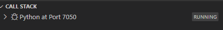

Mettre les fichiers blender dans "blender"

Pour la simuation, je pense que si on fait une classe par machin simulé ça pourrait bien allez à intégrer à la toute fin.

##  **pour faire un script qui affecte une scène blender:**

###  **setup de vscode**

le python se trouve ici (pour 2.90 sur windows 10):
* "C:\Program Files\Blender Foundation\Blender 2.90\2.90\python\bin"

entrer la commande:
* "C:\Program Files\Blender Foundation\Blender 2.90\2.90\python\bin\python" -m pip install matplotlib --user

* Installer l'extension blender Development:

  **Name**: Blender Development
  
  **Id**: jacqueslucke.blender-development

  **Description**: Tools to simplify Blender development.

  **Version**: 0.0.12

  **Publisher**: Jacques Lucke

  VS Marketplace Link: https://marketplace.visualstudio.com/items?itemName=JacquesLucke.blender-development

* Démarer blender: ctrl+shift+p: Blender start
 

* Allez dans le fichier python désiré puis ctrl+shift+p: blender run script